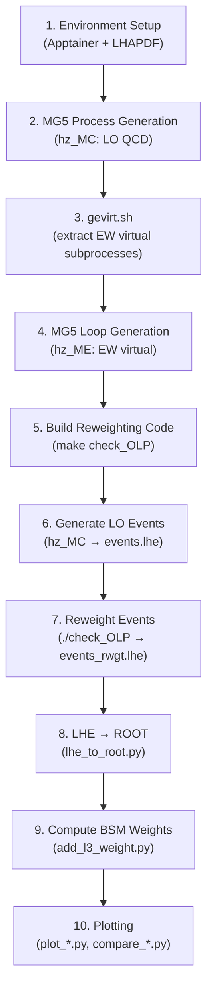

# Higgs Self-Coupling (λ₃) Study Pipeline — ZH Process

## Theoretical Background

The Higgs trilinear self-coupling λ₃ (the HHH vertex) cannot be directly measured in single-Higgs processes at tree level. However, λ₃ enters **at one loop** in processes like `pp → ZH`, `VBF`, `tHj`, and `ttH` through virtual corrections involving the H→HH splitting.

> [!IMPORTANT]
> The key idea (arXiv:1607.04251, arXiv:1709.08649) is to compute the **ratio of the NLO EW correction to the LO cross section** — the coefficient **C₁** — which encodes the sensitivity to λ₃. For ZH at 13 TeV: **C₁ = XK3/XLO ≈ 1.19%**.

The full BSM cross section for arbitrary κ_λ is reconstructed via analytic rescaling:

```
σ(κ_λ) = σ_LO × ZH_BSM × [ 1 + κ_λ·C₁ + δ_ZH + higher-order terms ]
```

where `ZH_BSM = 1 / (1 - (κ_λ² - 1)·δ_ZH)` with `δ_ZH ≈ -1.536×10⁻³`.

---

## Pipeline Overview



---

## Step-by-Step Workflow

### 1. Environment Setup

The pipeline requires GCC ≥ 4.6.0, MG5_aMC **v2.5.5** specifically, and LHAPDF 6.2.1. An Apptainer container provides the correct environment.

| Component | Location |
|---|---|
| Container | [trilinear_latest.sif](file:///afs/cern.ch/user/l/lichengz/works_dir/private/selfcoupling/trilinear_latest.sif) |
| LHAPDF 6.2.1 | [LHAPDF-6.2.1/](file:///afs/cern.ch/user/l/lichengz/works_dir/private/selfcoupling/LHAPDF-6.2.1) |
| Env script | [lhapdf_env.sh](file:///afs/cern.ch/user/l/lichengz/works_dir/private/selfcoupling/lhapdf_env.sh) |
| MadGraph | [MG5_aMC_v2_5_5/](file:///afs/cern.ch/user/l/lichengz/works_dir/private/selfcoupling/MG5_aMC_v2_5_5) |

**Activation:**
```bash
source lhapdf_env.sh
# This sets PYTHONPATH, LD_LIBRARY_PATH, PATH, then runs:
# apptainer run --env ... trilinear_latest.sif
```

### 2. Generate LO QCD Process (hz_MC)

Inside MG5, using the `hhh-model` UFO:

```
import model hhh-model
generate p p > h z [LOonly= QCD]
output hz_MC
quit
```

This creates the LO process directory `hz_MC/` with the standard MadGraph structure.

> [!NOTE]
> The `[LOonly= QCD]` syntax is crucial — it tells MG5 to generate at LO in QCD but prepare the infrastructure for NLO EW virtual corrections.

### 3. Extract Virtual EW Subprocesses (gevirt.sh)

```bash
cp trilinear-RW/gevirt.sh MG5_aMC_v2_5_5/
cd MG5_aMC_v2_5_5/
./gevirt.sh hz_MC
```

**Outputs:** `check_olp.inc` (Fortran include mapping PDGs → MadLoop calls) and `proc_ml` (process list for loop generation).

### 4. Generate EW Virtual Matrix Elements (hz_ME)

```bash
# First: copy the diagram filter
cp trilinear-RW/vvh-loop_diagram_generation.py madgraph/loop/loop_diagram_generation.py

# Then in MG5:
import model hhh-model
<contents of proc_ml>
output hz_ME
```

> [!CAUTION]
> Do **NOT** install COLLIER. If installed, disable it in `input/mg5_configuration.txt`: set `collier = None`.

### 5. Build the Reweighting Executable

Copy required files into `hz_ME/SubProcesses/`:

| File | Source |
|---|---|
| [makefile](file:///afs/cern.ch/user/l/lichengz/works_dir/private/selfcoupling/trilinear-RW/makefile), [check_OLP.f](file:///afs/cern.ch/user/l/lichengz/works_dir/private/selfcoupling/trilinear-RW/check_OLP.f) | `trilinear-RW/` |
| `check_olp.inc` | Generated by [gevirt.sh](file:///afs/cern.ch/user/l/lichengz/works_dir/private/selfcoupling/trilinear-RW/gevirt.sh) (step 3) |
| `pmass.inc`, `nsqso_born.inc`, `nsquaredSO.inc` | Any subprocess folder in `hz_ME/` |
| `c_weight.inc` | `hz_MC/SubProcesses/` |
| `nexternal.inc` | Any subprocess folder in `hz_MC/` |

Copy PDF libraries into `hz_ME/lib/`:
- `libpdf.a`, `Pdfdata/`, `PDFsets/` — from any MG5-generated process's `lib/`
- `libLHAPDF.a` — from `lhapdf/lib/`

Then build:
```bash
cd hz_ME/SubProcesses/
make OLP_static
make check_OLP
# → produces executable: check_OLP
```

### 6. Generate LO Events

Set `True = store_rwgt_info` in `hz_MC/Cards/run_card.dat`, then launch:

```
launch hz_MC
  fixedorder = OFF
  shower     = OFF
  reweight   = OFF
  order      = LO
  madspin    = OFF
```

**Benchmarking settings** (from [run_card.dat](file:///afs/cern.ch/user/l/lichengz/works_dir/private/selfcoupling/trilinear-RW/example_hz/run_card.dat)):
- 13 TeV (or 13.6 TeV for Run 3)
- PDF: lhapdf ID 90500 (or nn23nlo/244600)
- Fixed scale: (m_H + m_Z)/2 = 108.09 GeV
- 500K events

### 7. Reweight Events

```bash
gunzip -c hz_MC/Events/run_01_LO/events.lhe.gz > hz_ME/SubProcesses/events.lhe
cd hz_ME/SubProcesses/
./check_OLP
# Input:  events.lhe     (unweighted, original LO weights)
# Output: events_rwgt.lhe (new weights = O(λ₃) NLO EW correction only)
```

**Benchmark validation** (13 TeV, 500K events):
```
SUM OF ORIGINAL WEIGHTS (XLO):  315494.71
SUM OF NEW WEIGHTS (XK3):       3750.01
=> C1 = XK3/XLO = 0.0119 (1.19%)
```

### 8. Convert LHE → ROOT

```bash
python3 scripts/lhe_to_root.py events.lhe events_lo.root          # LO file
python3 scripts/lhe_to_root.py events_rwgt.lhe events_rwgt.root    # Reweighted file
```

**Output branches:** `event_id`, `v_m`, `v_pt`, `v_eta`, `v_phi`, `h_m`, `h_pt`, `h_eta`, `h_phi`, `h_y`, `vh_m`, `vh_delta_eta`, `cos_theta_star`, `weight`

### 9. Compute BSM Weights for Arbitrary κ_λ

```bash
# For κ_λ = 1.0 (SM):
python3 scripts/add_l3_weight.py events_lo.root events_rwgt.root --l3 1.0

# For other κ_λ values:
python3 scripts/add_l3_weight.py events_lo.root events_rwgt.root --l3 2.0
python3 scripts/add_l3_weight.py events_lo.root events_rwgt.root --l3 5.0
python3 scripts/add_l3_weight.py events_lo.root events_rwgt.root --l3 -10.0
# etc.
```

**What `add_l3_weight.py` computes** (per-event):
1. **C₁** = w_ew / w_lo (ratio of reweighted to LO weight)
2. **ZH_BSM** = 1 / (1 − (κ_λ² − 1) · δ_ZH), where δ_ZH = −1.536×10⁻³
3. **δ_λ₃** = (ZH_BSM − 1)·(1 + δ_ZH) + (ZH_BSM·κ_λ − 1)·C₁
4. **w_l3** = δ_λ₃ · w_lo + w_nlo_l3

**Three output files per κ_λ value:**

| File pattern | Content |
|---|---|
| `*_l3corr.root` | LO events with `weight = w_lo·(1 + C₁ + δ_ZH)` |
| `*_l3corr_nloew_<κ>.root` | NLO EW events: `weight = ZH_BSM · w_lo · (κ_λ·C₁ − C₁ + K_ew)` |
| `*_l3corr_<κ>.root` | Full BSM-reweighted events |

### 10. Plotting Suite

All scripts are in [scripts/](file:///afs/cern.ch/user/l/lichengz/works_dir/private/selfcoupling/scripts).

| Script | Purpose | Usage |
|---|---|---|
| [plot_weight_ratio.py](file:///afs/cern.ch/user/l/lichengz/works_dir/private/selfcoupling/scripts/plot_weight_ratio.py) | Histogram of per-event C₁ distribution | `python3 scripts/plot_weight_ratio.py lo.root rwgt.root` |
| [plot_C1_vs_pt.py](file:///afs/cern.ch/user/l/lichengz/works_dir/private/selfcoupling/scripts/plot_C1_vs_pt.py) | C₁ as function of pT(H) | `python3 scripts/plot_C1_vs_pt.py lo.root rwgt.root` |
| [compare_and_C1.py](file:///afs/cern.ch/user/l/lichengz/works_dir/private/selfcoupling/scripts/compare_and_C1.py) | Two-panel: density + C₁ for 6 variables | `python3 scripts/compare_and_C1.py lo.root rwgt.root` |
| [compare_roots.py](file:///afs/cern.ch/user/l/lichengz/works_dir/private/selfcoupling/scripts/compare_roots.py) | Event-by-event scatter + histogram comparison | `python3 scripts/compare_roots.py fileA.root fileB.root` |
| [plot_kappa3.py](file:///afs/cern.ch/user/l/lichengz/works_dir/private/selfcoupling/scripts/plot_kappa3.py) | Multi-κ_λ overlay with BSM/SM ratio | `python3 scripts/plot_kappa3.py nlo_base.root lo.root --feature h_pt` |

**Variables plotted by `compare_and_C1.py`:** pT(H), pT(V), m(VH), y(H), Δη(V,H), cos θ*

---

## Existing Output Files

The [scripts/](file:///afs/cern.ch/user/l/lichengz/works_dir/private/selfcoupling/scripts) directory already contains processed ROOT files for 500K events at 13.6 TeV:

- **LO:** `events_500k_13p6.root`
- **Reweighted:** `events_500k_13p6_rwgt.root`
- **NLO-corrected LO:** `events_500k_13p6_l3corr.root`
- **BSM variants:** `*_l3corr_<κ>.root` for κ_λ ∈ {0, 1, 2, 5, 10, −2, −5, −10}
- **NLO EW variants:** `*_l3corr_nloew_<κ>.root` for same κ_λ values
- **Plots:** `C1_vs_pt.png`, `weight_ratio.png`, `compare_and_C1.png`, `compare_scatter.png`, `*_kappa3.png`, `*_nlo_only.png`, `*_vs_lo.png`

---

## Quick Reproduction Commands

```bash
# ── Full pipeline from existing LHE files ──

# 1. Convert LHE → ROOT
python3 scripts/lhe_to_root.py events.lhe scripts/events_lo.root
python3 scripts/lhe_to_root.py events_rwgt.lhe scripts/events_rwgt.root

# 2. Compute BSM weights for multiple κ_λ
for kl in 0.0 1.0 2.0 5.0 10.0; do
  python3 scripts/add_l3_weight.py scripts/events_lo.root scripts/events_rwgt.root --l3 $kl
done
for kl in -2.0 -5.0 -10.0; do
  python3 scripts/add_l3_weight.py scripts/events_lo.root scripts/events_rwgt.root --l3 $kl
done

# 3. Make all plots
python3 scripts/plot_weight_ratio.py scripts/events_lo.root scripts/events_rwgt.root
python3 scripts/plot_C1_vs_pt.py scripts/events_lo.root scripts/events_rwgt.root
python3 scripts/compare_and_C1.py scripts/events_lo.root scripts/events_rwgt.root
python3 scripts/compare_roots.py scripts/events_lo.root scripts/events_rwgt.root
python3 scripts/plot_kappa3.py scripts/events_rwgt_l3corr.root scripts/events_lo.root --feature h_pt
```

---

## External References

- **Trilinear-RW code & theory:** [CP3 MadGraph Wiki](https://cp3.irmp.ucl.ac.be/projects/madgraph/wiki/HiggsSelfCoupling)
- **Environment setup guide:** [Charlotte-Knight/trilinear-env](https://github.com/Charlotte-Knight/trilinear-env)
- **Theory papers:** arXiv:1607.04251, arXiv:1709.08649 (Maltoni, Pagani, Shivaji, Zhao)
